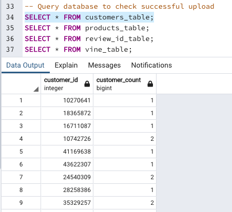

# Amazon_Vine_Analysis

## Overview of the analysis
In this challenge, we are analyzing Amazon reviews written by both members of the paid Amazon Vine Program and non-paying users as well. We had access to over 50 datasets and I chose to analyze Pet Product reviews. 

I used PySpark to extract, transform and loaded the Pet review data by connecting to an AWS RDS instance, and loaded the filtered data into pgAdmin. See the results below:
#### Customers table:

#### Products table:

#### Review table:

#### Vine table:

### Next steps
After loading the data into pgAdmin and examining the tables, I then used PySpark to analyze the Vine table. I analyzed this data to determine if there is any bias toward favorable reviews from Vine members in this dataset.

## Results
#### 1. How many Vine reviews and non-Vine reviews were there?

* Number of Vine reviews: 170
* Number of non-Vine reviews: 37,840

#### 2. How many Vine reviews were 5 stars? How many non-Vine reviews were 5 stars?

* A total of 65 Vine reviews were 5 stars.
* A total of 20,612 non-Vine reviews were 5 stars.

#### 3. What percentage of Vine reviews were 5 stars? 

Since there are 170 total Vine reviews and 65 of those were 5 stars, that means *38.2% of total Vine reviews are 5 stars.*

#### 4. What percentage of non-Vine reviews were 5 stars?

Since there are 37,840 total non-Vine reviews and 20,612 of those were 5 stars, that means *54.5 % of total non-Vine reviews are 5 stars.*

## Summary
In conclusion, there is no bias from Vine users when it comes to five-star ratings on this set of Amazon review data. Upon further analysis, I found that out of the total (filtered) reviews, 54.4% of them are 5 stars. Out of the total five-star reviews, only 0.3% are from Vine users and 99.7% are from non-Vine users. 

With such a small percentage of Vine users contributing to the total five-star reviews, we can conclude that there is no bias in this ratings data. 
